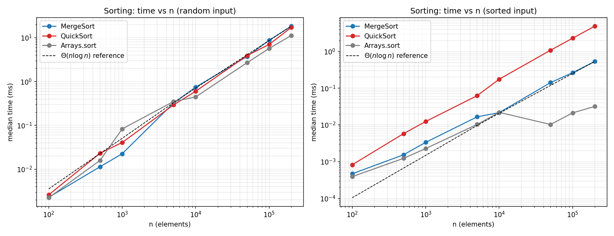
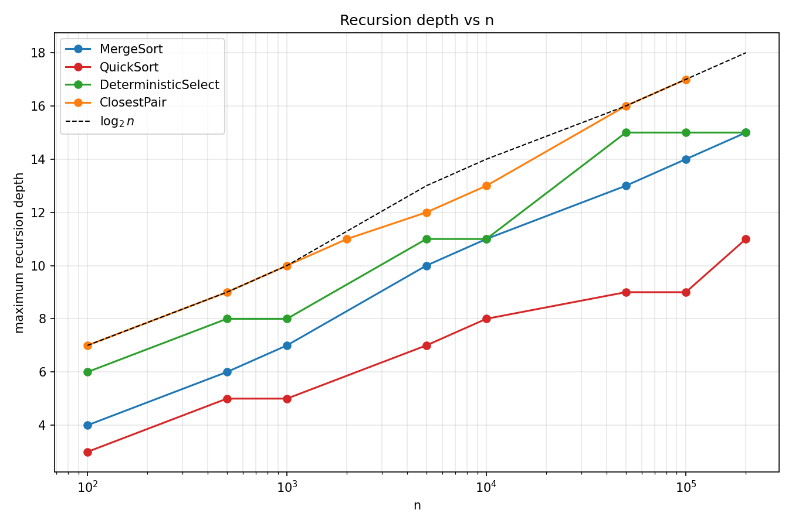
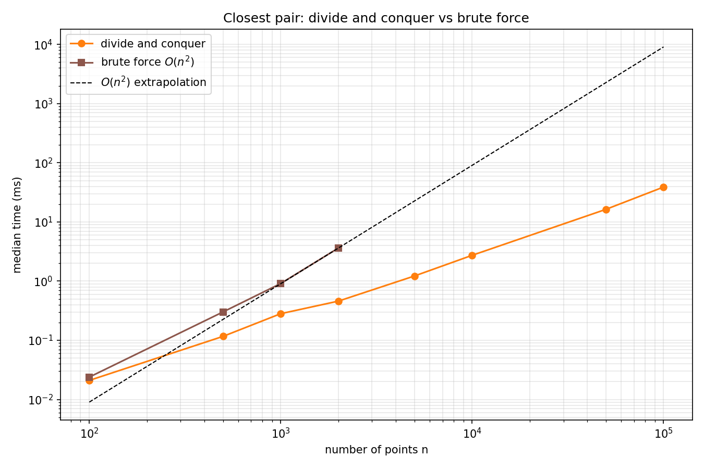
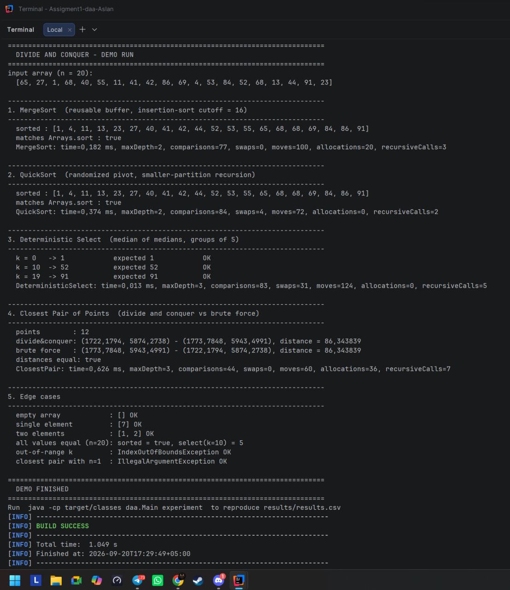
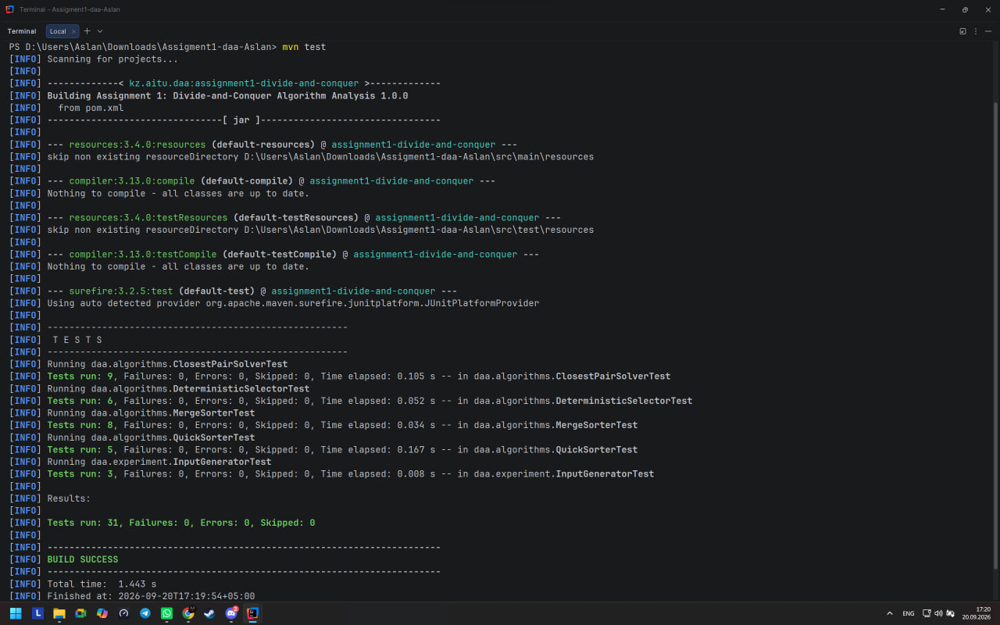
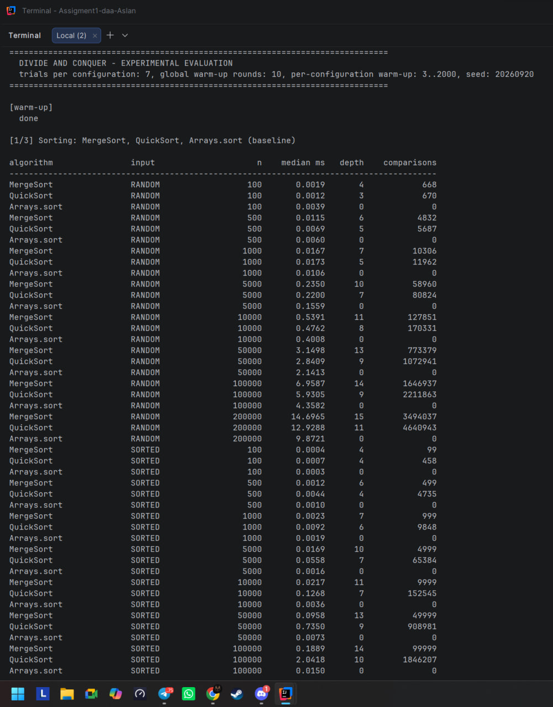
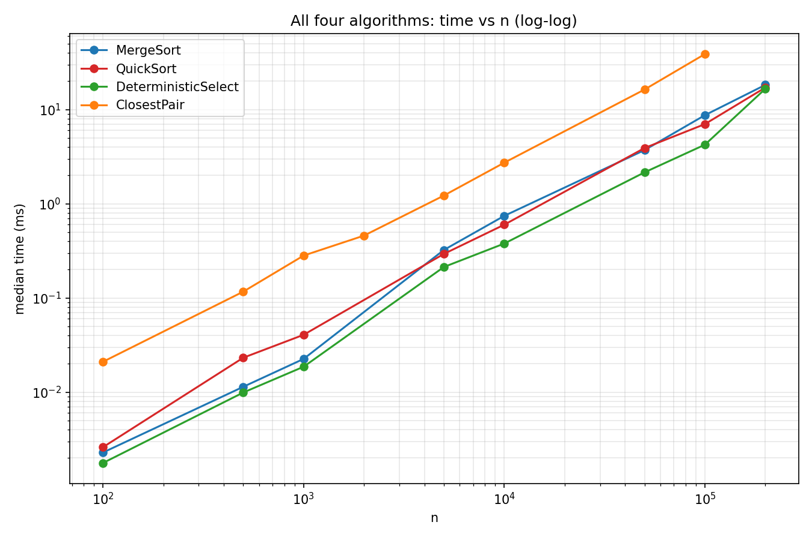

# Assignment 1: Divide-and-Conquer Algorithm Analysis

## A. Overview

Implements and benchmarks four divide-and-conquer algorithms in Java 17, comparing
measured time/depth/comparisons against theoretical complexity:

1. **MergeSort** — Θ(n log n), reusable buffer, insertion-sort cutoff.
2. **QuickSort** — randomized pivot, in-place partition, recurses into the smaller side.
3. **Deterministic Select** (Median of Medians) — worst-case Θ(n).
4. **Closest Pair of Points** — Θ(n log n) via strip-based merge.

```
src/daa/            algorithms, metrics, model, experiment
tests/daa/          31 JUnit 5 tests
docs/plots/         generated plots
docs/screenshots/   program output / test results / experiment run
results/results.csv raw benchmark data (1 row per trial)
```

**Run:**
```
mvn test
mvn compile exec:java
mvn compile exec:java '-Dexec.args="experiment"'
python3 docs/make_plots.py
```

## B. Algorithm Analysis

**MergeSort.** Splits at the midpoint, sorts each half, merges linearly through one
shared buffer; falls back to insertion sort below 16 elements.
Recurrence: T(n) = 2T(n/2) + Θ(n) → **Master Theorem Case 2 → Θ(n log n)**.
Space: Θ(n) buffer + Θ(log n) stack.

**QuickSort.** Random pivot, Hoare partition, recurses into the *smaller* partition and
loops over the larger one — this bounds recursion depth at O(log n) even in bad cases.
Expected recurrence has the same shape as MergeSort → **Θ(n log n)** expected;
**O(n²)** worst case (negligible probability due to randomization).

**Deterministic Select.** Groups of 5 → sort each → take medians → recursively find the
median of medians as pivot → three-way in-place partition → recurse only into the side
that must contain the k-th element.
Recurrence: T(n) = T(n/5) + T(7n/10) + Θ(n). Doesn't fit Master Theorem (unequal
subproblem sizes); solved via **Akra–Bazzi / substitution**: fractions sum to
1/5 + 7/10 = 9/10 < 1, so the work converges → **Θ(n)**.

**Closest Pair.** Sort by x once; each recursive call also leaves its range sorted by y
(via the same merge trick as MergeSort, so no re-sorting inside recursion); scan a thin
strip around the split line, comparing each point to at most 7 neighbors.
Recurrence: T(n) = 2T(n/2) + Θ(n) → **Master Theorem Case 2 → Θ(n log n)**.

## C. Experimental Results

Median of 7 timed trials per configuration, after adaptive warm-up. Full data:
[`results/results.csv`](results/results.csv) (1,372 rows).

**Sorting time (ms), RANDOM input**

| n | MergeSort | QuickSort | Arrays.sort |
|---|---|---|---|
| 1,000 | 0.023 | 0.041 | 0.083 |
| 10,000 | 0.744 | 0.600 | 0.445 |
| 100,000 | 8.726 | 7.015 | 5.680 |
| 200,000 | 18.290 | 17.134 | 11.241 |

**Selection time (ms), RANDOM input**

| n | DeterministicSelect | Sort+Index |
|---|---|---|
| 1,000 | 0.019 | 0.017 |
| 10,000 | 0.378 | 0.446 |
| 100,000 | 4.242 | 5.738 |
| 200,000 | 16.622 | 24.317 |

**Closest Pair time (ms), UNIFORM points**

| n | ClosestPair | Brute force O(n²) |
|---|---|---|
| 1,000 | 0.282 | 0.912 |
| 2,000 | 0.460 | 3.619 |
| 10,000 | 2.732 | *(not run, n > 2,000)* |
| 100,000 | 38.863 | — |

**Max recursion depth**

| n | MergeSort | QuickSort | Select | ClosestPair |
|---|---|---|---|---|
| 1,000 | 7 | 5 | 8 | 10 |
| 10,000 | 11 | 8 | 11 | 13 |
| 100,000 | 14 | 9 | 15 | 17 |
| 200,000 | 15 | 11 | 15 | — |

log₂(200,000) ≈ 17.6 — every algorithm's depth tracks this bound; QuickSort stays
*below* it because the smaller-partition recursion discards the larger side entirely.

Input shape (sorted / reverse / duplicate-heavy) barely affects MergeSort, but roughly
doubles/triples QuickSort's comparisons on already-sorted data — see the full tables and
plots in `results/results.csv` and `docs/plots/`.

**Plots:**





(3 more plots — input-type effect, all-algorithms overview, selection linearity — are in
`docs/plots/`.)

## D. Discussion

- **Match theory?** Yes — log-log time plots track n log n / n / n² lines closely, and
  measured depth stays at or below log₂ n throughout.
- **Input structure?** MergeSort is nearly input-independent. QuickSort does more
  comparisons on sorted/reverse input (random pivot still occasionally splits unevenly)
  but never degrades to O(n²) in practice; duplicate-heavy input stays close to random
  thanks to three-way/Hoare partitioning.
- **Why smaller-first recursion helps QuickSort:** it guarantees the recursed-into side
  is ≤ n/2, bounding stack depth at O(log n) regardless of pivot luck — this is a
  space guarantee, not a time one.
- **Why Median-of-Medians is O(n):** the pivot is provably better than ~3n/10 elements
  on each side, so the recurrence's fractions (1/5 + 7/10 = 9/10 < 1) form a convergent
  series instead of growing.
- **Why Closest Pair beats O(n²):** it avoids checking all pairs — only a thin strip is
  rechecked after the split, and each strip point is compared to at most 7 neighbors
  (geometric packing bound), turning n² work into n log n.
- **Practical factors:** JIT warm-up dominates small-n timing (hence the adaptive
  warm-up in `Experiment.java`); cache-friendly sequential access helps MergeSort/
  QuickSort; none of the four algorithms allocate per recursive call, so GC pressure is
  minimal.

## E. Reflection

The main lesson was that the *shape* of the recursion — not just its Big-O — is what
prevents real degradation: QuickSort's smaller-first rule and Select's 7n/10 bound both
look like footnotes on paper but are the entire reason depth/time stay controlled in
practice. The trickiest parts to implement were keeping Closest Pair's y-order
*incremental* (via merge) instead of re-sorting every level, making the three-way
partition in Select correct on heavy duplicates, and taming JIT warm-up noise in the
benchmark so small-n timings weren't dominated by interpreter overhead.

## F. Screenshots




